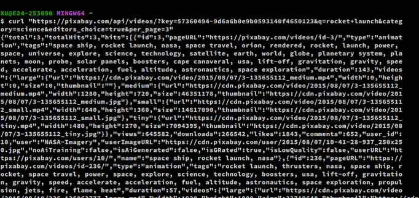
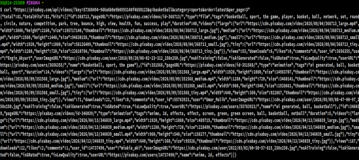
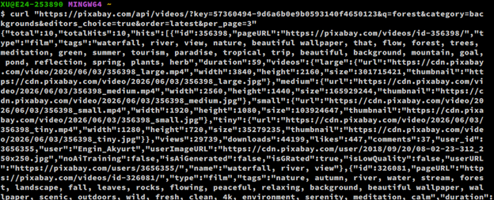
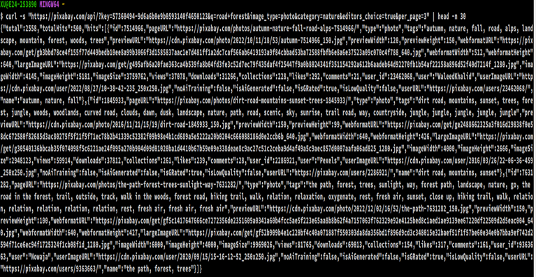

# Adorable_LabPractice_PixaBay

## Overview

This repository documents my work for the Pixabay API Practice Lab. In this lab I built four different search requests against the Pixabay REST API — three against the video endpoint (`https://pixabay.com/api/videos/`) and one against the photo endpoint (`https://pixabay.com/api/`) — using `curl` to send each request and reading the JSON response that came back. Each challenge below shows the parameters I used, the full request, and a screenshot of the response.

My API key has been redacted from every screenshot below and replaced with `YOUR_API_KEY` in any URL shown as text.

---

## Challenge 1: Rocket Launch (Video)

**Goal:** Search Pixabay's video library for "rocket launch" videos, filtered to the Science category and limited to Editor's Choice results only.

**Parameters used:**
- `q` (query) = `rocket launch`
- Endpoint = video (`/api/videos/`)
- `category` = `science`
- `editors_choice` = `true`
- `per_page` = `3`

**Request:**
```
curl "https://pixabay.com/api/videos/?key=YOUR_API_KEY&q=rocket+launch&category=science&editors_choice=true&per_page=3"
```

**Response:**



The response returned 3 total hits, all tagged with rocket/space/science-related terms such as "rocket launch," "nasa," and "space exploration," confirming the category and search term filters worked as expected.

---

## Challenge 2: Basketball (Video)

**Goal:** Search for "basketball" videos in the Sports category, ordered by the most recently uploaded.

**Parameters used:**
- `q` (query) = `basketball`
- Endpoint = video (`/api/videos/`)
- `category` = `sports`
- `order` = `latest`
- `per_page` = `3`

**Request:**
```
curl "https://pixabay.com/api/videos/?key=YOUR_API_KEY&q=basketball&category=sports&order=latest&per_page=3"
```

**Response:**



The response returned 81 total hits matching "basketball," with the 3 shown being the most recently uploaded (`order=latest`), which is why some of the results are newer, lower-view-count clips rather than the most popular ones.

---

## Challenge 3: Forest (Video)

**Goal:** Search for "forest" videos in the Backgrounds category, restricted to Editor's Choice, ordered by latest.

Unlike the previous two challenges, this section lists each query parameter individually rather than only showing the finished URL, to show that I understand what each piece of the request does on its own.

**Query parameters:**

| Parameter | Value |
|---|---|
| `key` | YOUR_API_KEY |
| `q` | forest |
| `category` | backgrounds |
| `editors_choice` | true |
| `order` | latest |
| `per_page` | 3 |

**Assembled request URL:**
```
https://pixabay.com/api/videos/?key=YOUR_API_KEY&q=forest&category=backgrounds&editors_choice=true&order=latest&per_page=3
```

**Request:**
```
curl "https://pixabay.com/api/videos/?key=YOUR_API_KEY&q=forest&category=backgrounds&editors_choice=true&order=latest&per_page=3"
```

**Response:**



The response returned 10 total hits, all nature/waterfall/forest-themed clips consistent with the "backgrounds" category and "forest" search term.

---

## Challenge 4: Road Forest (Photo)

**Goal:** Search Pixabay's photo library for "road forest" images in the Nature category, restricted to Editor's Choice.

**Parameters used:**
- `q` (query) = `road forest`
- `image_type` = `photo`
- `category` = `nature`
- `editors_choice` = `true`
- `per_page` = `3`

**Request:**
```
curl -s "https://pixabay.com/api/?key=YOUR_API_KEY&q=road+forest&image_type=photo&category=nature&editors_choice=true&per_page=3" | head -n 30
```

The output was piped through `head -n 30` since photo JSON responses can run long, and only the top 30 lines were required.

**Response (top 30 lines):**



The response returned 500 total hits out of 2,558 possible matches, with the top 3 results showing autumn road, dirt road/mountain, and forest path photos — all consistent with the "nature" category and "road forest" search term.

---

## What I Learned

Working through these four challenges helped me understand how REST API query parameters work in practice:

- The `?` marks the start of query parameters, and every parameter after it is joined with `&`.
- Query strings must be quoted in the terminal, since an unquoted `&` tells the shell to run the command in the background rather than passing it as part of the URL.
- Different endpoints (`/api/` for photos vs. `/api/videos/` for videos) accept slightly different parameters (`image_type` vs. `video_type`), even though many parameters like `category`, `editors_choice`, `order`, and `per_page` are shared across both.
- Reading the JSON response structure (`total`, `totalHits`, `hits`) makes it possible to verify that the filters you sent were actually applied.
